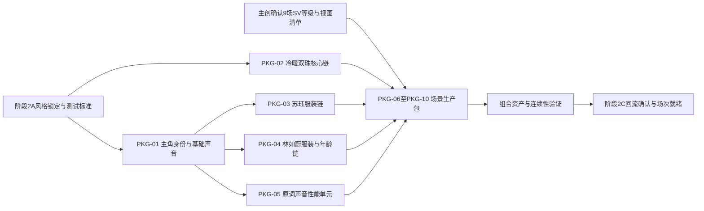

# 《千年寻缘・珠定团圆》阶段1资产生产计划与可执行生产包

版本：v1.0  
日期：2026-07-14  
规则系统：v1.0.1  
模型适配卡：MA-SD2.0-BASE-v1.0  
分析范围：V4黄色高亮5个AI段落（P009–P015、P030–P037、P050–P061、P079–P088、P096–P104）

> 本文件只定义阶段2的制作顺序、依赖、审批门和完成条件，不制作风格设定、资产Prompt、正式分镜或Seedance2.0镜头Prompt。

## 1. 资产总量与优先级

- 资产总量：105项。
- P0：57项。
- P1：40项。
- P2：8项。
- 声音资产生产状态：默认启用。
- 场景视图状态：9场已由主创于2026-07-14按建议确认；SV0共3场、SV1共4场、SV2共2场，稳定视图ID已锁定。

### 第一批建议制作

1. 两位主角基础脸、身形和基础音色。
2. 冷暖双珠形制、尺寸、系绳与低亮珠光技术测试。
3. 苏珏三套基础服装；林如蔚常服A、常服B、暮年自然老化测试。
4. P0场景母图：神话山湖、龙水湖青石岸、临水廊亭、三孔石桥渡口、祈福树固定机位湖岸。
5. P0声音性能单元，完整保留原词。

### 第二批建议制作

1. 林如蔚春夏秋冬、湿裙追船等状态变体。
2. 山城防线、战乱街巷、九龙水法岩壁和相应光影。
3. 九龙、群演、白鹭、小舟、渡船、红绸、文书、书卷与生活道具。
4. 季节、烽烟、薄雪、冷雾、转场等VFX模板。

### 可后置资产

- 王后抱子侧影服饰、殿宇帷幔意象空间、廊亭灯笼、行囊、逃难布包木箱、山城远处人影和军旗体系。
- P2后置不等于删除；它们仍须在对应场次进入“可分镜”前完成。

## 2. 总依赖与审批门

全局开始门：

- 阶段2A风格锁定包和测试资产标准已确认。
- 男女主真人演员参考图均已提供并登记为各自唯一外貌依据；生产身高锁定苏珏185厘米、林如蔚170厘米。
- 场景视图等级、最低视图清单和稳定视图ID已由主创确认。
- 冷暖珠尺寸、系绳方式、暮年年龄观感等会改变组合资产的主创项已处理。

全局完成门：

- 每项资产有实际文件、生产资产ID、来源、状态和映射记录。
- P0/P1资产通过相应基础资产或母图审批门。
- 关系资产所列连续性在组合图中验证，不只在文字表里存在。
- 实际回流资产经阶段2C确认后才能进入场次就绪表。

## 3. 可执行生产包

### QNXY-PKG-01｜主角身份与基础声音

- 覆盖范围：AI-01至AI-05全范围。
- 包含资产ID：`QNXY-CHR-P0-001-苏珏`、`QNXY-CHR-P0-002-林如蔚`、`QNXY-VOI-P0-001-苏珏基础音色`、`QNXY-VOI-P0-002-林如蔚基础音色`、`QNXY-REL-P0-001-苏珏跨服装同脸连续性`、`QNXY-REL-P0-002-林如蔚跨服装年龄同脸连续性`。
- 类别与级别：CHR / VOI / REL，全部P0。
- 阶段2执行小组：人物资产组＋声音资产组。
- 前置依赖：阶段2A人物质感标准；对应角色真人演员参考图；已确认的主角声音方向；参考登记见`data/04_阶段1_参考素材登记.csv`。
- 开始条件：男女演员参考图可读取，脸部角度和清晰度足以锁定；185/170厘米生产尺度已登记；声音资产默认启用。双主角材料门均已满足。
- 审批门：风格验证＋剧照验证＋音色验证。
- 交付形态：两位主角脸部验证、全身比例、基础中性表情、基础音色样本和一对多状态映射。
- 完成条件：真人相似度、同一骨相、真实肤质和声音区分通过；没有陌生脸、网红化或播音腔。
- 阻断项：阶段2A人物质感/比例验证或基础音色样本未通过；不再存在演员参考图缺失阻断。
- 影响场次就绪：全部5个AI段落。
- 可并行生产包：PKG-02。
- 后续生产包：PKG-03、PKG-04、PKG-05。

### QNXY-PKG-02｜冷暖双珠核心道具、VFX与声音链

- 覆盖范围：AI-01、AI-04、AI-05。
- 包含资产ID：`QNXY-PRP-P0-001-冷珠`、`QNXY-PRP-P0-002-暖珠`、`QNXY-VFX-P0-002-冷暖双珠凝结与克制珠光`、`QNXY-SND-P0-002-冷暖双珠玉石共鸣`、`QNXY-REL-P0-004-双珠凝结离散关系`、`QNXY-REL-P0-005-双珠互赠归属连续性`、`QNXY-REL-P0-006-暖珠甲胄固定连续性`、`QNXY-REL-P0-007-冷珠手链腕戴终身连续性`。
- 类别与级别：PRP / VFX / SND / REL，全部P0。
- 阶段2执行小组：道具组＋VFX组＋声音组。
- 前置依赖：阶段2A材质和低亮VFX标准；已确认的手链形制、小型古玉、克制系绳方向与交换前归属；`QNXY-REF-013/015`外观参考和腕戴生产锁定。
- 开始条件：MC-08按主创追加修正为双珠手链口径；冷珠交换后持续腕戴，暖珠交换后转为甲胄系挂；参考图已登记；精确珠径、腕围、闭合方式和甲胄固定点由阶段2A测试锁定。
- 审批门：风格验证＋基础资产确认＋技术测试。
- 交付形态：冷珠和暖珠多角度、手链全环、腕戴比例、交换转接、冷珠终身腕戴、暖珠甲胄固定、凝结/离散低亮VFX样本、冷暖音色样本。
- 完成条件：尺寸不漂移；珠光不爆；冷暖可辨而同源；冷珠腕部与暖珠甲片接触可信；冷珠在追船、四季和暮年不消失、不转为掌心握持或颈戴。
- 阻断项：阶段2A尺寸、系绳或甲胄接触技术测试未通过。
- 影响场次就绪：AI-01、AI-04、AI-05。
- 可并行生产包：PKG-01。
- 后续生产包：PKG-06、PKG-09、PKG-10。

### QNXY-PKG-03｜苏珏服装与出征状态链

- 覆盖范围：AI-01至AI-04。
- 包含资产ID：`QNXY-CST-P0-001-苏珏湖岸常服A`、`QNXY-CST-P0-003-苏珏外出常服B`、`QNXY-CST-P0-005-苏珏从军披甲装`、`QNXY-PRP-P2-008-苏珏随身行囊`。
- 类别与级别：CST P0三项；PRP P2一项。
- 阶段2执行小组：人物服装组。
- 前置依赖：PKG-01主角脸确认；阶段2A南宋服装、材质和色彩体系；PKG-02暖珠尺寸；`QNXY-REF-007`至`010`限定服装参考。
- 开始条件：常服B比常服A更沉静、整齐、外出功能更强的方向已确认；苏珏演员与服装参考材料已登记。
- 审批门：剧照验证＋基础资产确认。
- 交付形态：三套服装正侧背、袖口/腰带/甲片/行囊细节、递书、攥文书、扣甲、系珠和登船动作适配。
- 完成条件：同一演员不换脸；轻甲不战神化；暖珠固定位置稳定；动作不穿模。
- 阻断项：阶段2A尚未启动，或人物/服装技术验证未通过；从军装仍需补全直接轻甲形制。
- 影响场次就绪：AI-01、AI-02、AI-03、AI-04。
- 可并行生产包：PKG-04、PKG-05。
- 后续生产包：PKG-06、PKG-07、PKG-08、PKG-09。

### QNXY-PKG-04｜林如蔚服装、追船状态与暮年链

- 覆盖范围：AI-01至AI-05。
- 包含资产ID：`QNXY-CST-P0-002-林如蔚湖岸常服A`、`QNXY-CST-P0-004-林如蔚廊亭告别常服B`、`QNXY-CST-P1-006-林如蔚石桥离别与湿裙追船状态`、`QNXY-CST-P1-007-林如蔚春季等待状态`、`QNXY-CST-P1-008-林如蔚夏季等待状态`、`QNXY-CST-P1-009-林如蔚秋季等待状态`、`QNXY-CST-P1-010-林如蔚冬季等待状态`、`QNXY-CST-P0-011-林如蔚暮年自然老化与素净衣装`、`QNXY-REL-P1-014-追船湿裙鬓发泪痕连续性`、`QNXY-REL-P0-016-四季服装姿态与暮年连续性`。
- 类别与级别：CST P0/P1＋REL P0/P1。
- 阶段2执行小组：人物服装组＋妆发/年龄状态组。
- 前置依赖：PKG-01林如蔚基础脸；阶段2A服装色彩；已确认沿用常服B的桥段基础服装和自然老化暮年方向；`QNXY-REF-004`至`006`的限定服装参考。
- 开始条件：MC-02、MC-09已确认；石桥沿用常服B，暮年保持同一骨相的自然老化与素净衣装；林如蔚演员与服装参考材料已登记。
- 审批门：剧照验证＋基础资产确认＋状态变体验证。
- 交付形态：常服A/B、湿裙干湿两态、春丝带、夏轻装坐姿、秋薄披素簪系绸、冬外氅薄雪、暮年自然老化。
- 完成条件：同脸同骨相；夏季坐姿和秋季系绸不被简化；冬季与暮年不混成同一状态；湿衣有重量。
- 阻断项：阶段2A尚未启动，或湿衣、冬装、暮年状态验证未通过；不再被林如蔚演员参考图缺失阻断。
- 影响场次就绪：全部5段，重点AI-04和AI-05。
- 可并行生产包：PKG-03、PKG-05。
- 后续生产包：PKG-06、PKG-07、PKG-08、PKG-10。

### QNXY-PKG-05｜原词声音性能单元

- 覆盖范围：全部台词、画外独白和画外音。
- 包含资产ID：`QNXY-VOI-P0-003-苏珏AI01画外独白`、`QNXY-VOI-P0-004-林如蔚AI02画外音`、`QNXY-VOI-P0-005-林如蔚AI03战乱画外音`、`QNXY-VOI-P0-006-林如蔚AI03决意画外音`、`QNXY-VOI-P0-007-林如蔚AI04离别画外音`、`QNXY-VOI-P0-008-林如蔚AI05四季画外音`、`QNXY-VOI-P0-009-苏珏AI03廊亭对白`、`QNXY-VOI-P0-010-林如蔚AI03廊亭对白`、`QNXY-VOI-P0-011-林如蔚AI04石桥对白`、`QNXY-VOI-P0-012-苏珏AI04石桥对白`、`QNXY-REL-P0-018-原台词画外音逐字与口型规则`。
- 类别与级别：VOI / REL，全部P0。
- 阶段2执行小组：声音资产组。
- 前置依赖：PKG-01两位主角基础音色确认。
- 开始条件：原词清单锁定；确认不改字、不调序、画外声音不绑口型、画内对白准确口型。
- 审批门：音色验证＋台词性能验证。
- 交付形态：10个原词性能单元、干净人声、参考语速与气口；不带音乐。
- 完成条件：逐字比对通过；AI-04顺序为林如蔚台词→停顿触手→苏珏台词；画外声无错误口型要求。
- 阻断项：基础音色未确认。
- 影响场次就绪：全部5段。
- 可并行生产包：PKG-03、PKG-04。
- 后续生产包：PKG-06至PKG-10。

### QNXY-PKG-06｜AI-01神话起源资产包

- 覆盖范围：V4标黄P009–P015。
- 包含资产ID：`QNXY-CHR-P1-003-王后抱襁褓太子侧影`、`QNXY-CST-P2-012-王后抱子侧影服饰状态`、`QNXY-SCN-P0-001-巴岳山麓龙水湖神话山湖`、`QNXY-SCN-P2-002-殿宇帷幔侧影视域`、`QNXY-SCN-P1-003-大足石刻式九龙水法岩壁`、`QNXY-SCN-P1-004-南宋山城防线远景`、`QNXY-LGT-P0-001-神话山湖晨光`、`QNXY-LGT-P1-002-神话山湖乱世压暗光影`、`QNXY-LGT-P2-003-殿宇冷暖水光`、`QNXY-LGT-P1-004-九龙水法冷暖水纹光`、`QNXY-LGT-P1-005-山城江雾烽烟光影`、`QNXY-VFX-P0-001-神话山湖水汽云雾汇聚`、`QNXY-VFX-P1-003-珠光化湖面水纹叠化`、`QNXY-VFX-P1-004-战乱烽烟尘土与风压`、`QNXY-VFX-P1-005-玉龙伏守山形与湖底微光`、`QNXY-CRE-P0-001-九龙神龙群`、`QNXY-CRO-P2-004-山城防线远处人影`、`QNXY-SYM-P1-001-九龙水法石刻纹理`、`QNXY-SYM-P2-003-南宋防线军旗体系`、`QNXY-SND-P0-001-九龙神话山湖声音母题`、`QNXY-SND-P1-004-山城防线战鼓风声`、`QNXY-SND-P1-009-珠光水纹转场声`、`QNXY-REL-P0-003-AI01青年女子身份映射`。
- 类别与级别：场景、光影、VFX、特殊生物、功能人物、符号、声音和关系，P0/P1/P2混合。
- 阶段2执行小组：场景组＋VFX/生物组＋声音组。
- 前置依赖：阶段2A神话写实风格；PKG-01、PKG-02、PKG-03、PKG-04、PKG-05；已确认的SCN-001/003/004视图；AI-01青年女子已确认映射为苏珏与林如蔚。
- 开始条件：SV等级和九龙云雾、剪影、局部鳞片、水汽运动曝光策略均已确认。
- 审批门：风格验证＋母图确认＋技术测试。
- 交付形态：场景母图/视图、九龙群体结构和遮挡测试、岩壁水法纹理、云雾/烽烟模板、神话声音参考。
- 完成条件：山湖地理稳定；九龙数量感成立且不怪物化；王后不露脸；现代触发镜头未混入。
- 阻断项：神话场景、九龙或主角组合技术验证未通过；不再存在演员参考图缺失阻断。
- 影响场次就绪：AI-01。
- 可并行生产包：场景确认后可与PKG-07至PKG-10并行。
- 后续生产包：阶段2C回流分析与AI-01场次就绪。

### QNXY-PKG-07｜AI-02小舟相见资产包

- 覆盖范围：V4标黄P030–P037。
- 包含资产ID：`QNXY-SCN-P0-005-南宋龙水湖湖面与青石岸`、`QNXY-LGT-P0-006-龙水湖清晨薄雾金光`、`QNXY-PRP-P1-003-书卷与纸墨包`、`QNXY-PRP-P1-004-竹篮药草与折衣组合`、`QNXY-ANM-P1-001-白鹭`、`QNXY-VEH-P0-001-南宋湖面小舟`、`QNXY-SND-P1-003-龙水湖清晨环境声`、`QNXY-REL-P1-008-小舟靠岸书卷交接关系`。
- 类别与级别：SCN / LGT / PRP / ANM / VEH / SND / REL，P0/P1。
- 阶段2执行小组：场景组＋道具载具组＋动物组＋声音组。
- 前置依赖：PKG-01、PKG-03、PKG-04、PKG-05；已确认的SCN-005 SV1视图体系和简朴南宋巴蜀木舟方向；精确形制由阶段2A校验。
- 开始条件：船向岸、岸向湖和小院出口稳定视图ID已确认。
- 审批门：母图确认＋空间补全确认＋基础资产确认。
- 交付形态：湖岸母图及指定视图、小舟结构/尺度、书卷与竹篮组合、白鹭飞行、清晨环境声。
- 完成条件：小舟靠岸路径、等待点、交接点、指尖短触和离开方向不矛盾；没有现代码头或渔夫污染。
- 阻断项：小舟精确形制或船岸空间补全未通过母图审批。
- 影响场次就绪：AI-02。
- 可并行生产包：PKG-06、PKG-08、PKG-09、PKG-10。
- 后续生产包：阶段2C回流分析与AI-02场次就绪。

### QNXY-PKG-08｜AI-03战乱街巷与廊亭告别资产包

- 覆盖范围：V4标黄P050–P061。
- 包含资产ID：`QNXY-SCN-P1-006-南宋战乱街巷`、`QNXY-SCN-P0-007-南宋临水古廊亭`、`QNXY-LGT-P1-007-战乱街巷阴天尘光`、`QNXY-LGT-P0-008-临水廊亭傍晚侧逆光`、`QNXY-PRP-P0-005-征募文书`、`QNXY-PRP-P2-009-廊亭灯笼`、`QNXY-PRP-P2-010-逃难布包木箱组`、`QNXY-CRO-P1-001-逃难百姓群像`、`QNXY-CRO-P1-002-乡间义士与青壮集结群像`、`QNXY-SND-P1-005-战乱街巷逃难环境声`、`QNXY-SND-P1-006-临水廊亭傍晚环境声`、`QNXY-REL-P1-009-征募文书决意连续性`、`QNXY-REL-P0-010-廊亭告别站位与对白连续性`。
- 类别与级别：SCN / LGT / PRP / CRO / SND / REL，P0/P1/P2。
- 阶段2执行小组：场景组＋群演组＋道具组＋声音组。
- 前置依赖：PKG-01、PKG-03、PKG-04、PKG-05；已确认的街巷SV1、廊亭SV2和征募文书一物多态口径。
- 开始条件：廊亭入口、栏杆区和标准五视图ID锁定。
- 审批门：母图确认＋空间补全确认＋群像差异验证。
- 交付形态：街巷和廊亭母图/视图、群像构成板、文书贴墙/手持/攥皱状态、环境声。
- 完成条件：无现代街招；群演不同脸不同造型；廊亭站位可支持苏珏未说完、林如蔚前进半步和并肩凭栏。
- 阻断项：廊亭母图/空间补全或常服B技术验证未通过。
- 影响场次就绪：AI-03。
- 可并行生产包：PKG-06、PKG-07、PKG-09、PKG-10。
- 后续生产包：阶段2C回流分析与AI-03场次就绪。

### QNXY-PKG-09｜AI-04三孔石桥互赠、登船与追船资产包

- 覆盖范围：V4标黄P079–P088。
- 包含资产ID：`QNXY-SCN-P0-008-南宋西子湾三孔石桥渡口与追船岸`、`QNXY-LGT-P0-009-西子湾黄昏金红余光`、`QNXY-PRP-P1-006-渡船粗麻缆绳`、`QNXY-CRO-P1-003-渡口船工单人配置`、`QNXY-VEH-P0-002-南宋渡船`、`QNXY-SND-P0-007-石桥渡船追船同期声组`、`QNXY-REL-P0-011-石桥赠珠触手对白固定顺序`、`QNXY-REL-P0-012-三孔桥渡口追船空间动线`、`QNXY-REL-P0-013-追船强制动作链`。
- 类别与级别：SCN / LGT / PRP / CRO / VEH / SND / REL，P0/P1。
- 阶段2执行小组：场景组＋载具道具组＋动作关系组＋声音组。
- 前置依赖：PKG-01至PKG-05；已确认的SCN-008 SV2、简朴木渡船方向、沿用常服B的桥段服装和追船动线；精确船型由阶段2A校验。
- 开始条件：三孔桥、SV2视图ID和互赠→登船→追船尽头→远船的关系已锁定；具体空间位置由阶段2A母图和五视图补全。
- 审批门：母图确认＋空间补全确认＋基础资产确认＋动作连续性验证。
- 交付形态：三孔桥母图/五视图、渡船结构和系泊、缆绳接触、船工解缆、关键动作姿态板、同期声清单。
- 完成条件：旧单孔桥污染为零；林台词→停顿触手→苏台词顺序正确；挥手、追至尽头、弯腰和手掌压膝四项动作全部有资产支撑。
- 阻断项：三孔桥母图/五视图空间补全或冷暖珠、甲胄、石桥服装基础资产未通过。
- 影响场次就绪：AI-04。
- 可并行生产包：空间确认后可与PKG-06、PKG-07、PKG-10并行。
- 后续生产包：阶段2C组合资产验证与AI-04场次就绪。

### QNXY-PKG-10｜AI-05祈福树四季与暮年资产包

- 覆盖范围：V4标黄P096–P104。
- 包含资产ID：`QNXY-SCN-P0-009-湖边祈福树固定机位湖岸`、`QNXY-LGT-P1-010-祈福树春季柔侧光`、`QNXY-LGT-P1-011-祈福树夏季树荫斑驳光`、`QNXY-LGT-P1-012-祈福树秋季低角度斜光`、`QNXY-LGT-P1-013-祈福树冬季冷漫反射`、`QNXY-LGT-P1-014-祈福树多年后背侧冷光`、`QNXY-PRP-P0-007-祈愿红绸`、`QNXY-VFX-P1-006-冬季薄雪冷雾与呼吸白气`、`QNXY-VFX-P1-007-固定机位四季连续变换`、`QNXY-SYM-P0-002-祈愿红绸题字`、`QNXY-SND-P0-008-祈福树四季湖岸环境组`、`QNXY-REL-P0-015-祈福树固定机位空间连续性`、`QNXY-REL-P1-017-红绸系挂旧化连续性`。
- 类别与级别：SCN / LGT / PRP / VFX / SYM / SND / REL，P0/P1。
- 阶段2执行小组：场景组＋季节/VFX组＋道具文字组＋声音组。
- 前置依赖：PKG-01、PKG-02、PKG-04、PKG-05；已确认的SCN-009 SV0、正文可读、不加落款和南宋语境手写方向；具体书体由阶段2A锁定。
- 开始条件：固定母图构图通过；同一树、同一湖岸、远山关系和红绸枝位锁定。
- 审批门：母图确认＋状态变体验证＋四季对齐技术测试。
- 交付形态：固定母图、春夏秋冬/多年后环境变体、红绸新旧四态、可读题字层、冬季VFX、五段环境声。
- 完成条件：机位、树、湖岸和远山不漂；夏季坐树下、秋季重系红绸、冬季外氅、暮年自然老化全部恢复；人物不被错误固定在同一站位。
- 阻断项：固定母图、四季几何对齐、文字贴合或暮年状态验证未通过。
- 影响场次就绪：AI-05。
- 可并行生产包：PKG-06至PKG-09。
- 后续生产包：阶段2C四季对齐验证与AI-05场次就绪。

## 4. 场次就绪定义

| AI段落 | 可进入分镜前最低完成包 | 额外完成条件 |
|---|---|---|
| AI-01 | PKG-01、02、03、04、05、06 | 九龙与双珠技术测试通过；青年/女子身份映射确认 |
| AI-02 | PKG-01、03、04、05、07 | 船岸方向和指尖交接关系图通过 |
| AI-03 | PKG-01、03、04、05、08 | 廊亭SV2、常服B和文书状态通过 |
| AI-04 | PKG-01、02、03、04、05、09 | 三孔桥空间、双珠归属、台词动作顺序和追船动作链通过 |
| AI-05 | PKG-01、02、04、05、10 | 固定母图、季节对齐、红绸文字和暮年状态通过 |

## 5. 需要技术测试的资产

1. 九龙群在云雾、剪影、局部鳞片下的数量感与写实度。
2. 冷暖双珠的低亮凝结、离散、手腕和甲胄接触，不产生法宝爆光。
3. 同一真人脸跨多套古装、湿衣、冬装和暮年自然老化的稳定性。
4. 三孔石桥—渡船—追船岸线的空间补全与连续动线。
5. 祈福树固定机位四季环境变体的几何对齐；人物姿态允许变化。
6. 可读祈愿文字在红绸变形与旧化中的稳定性。
7. 画内对白口型和画外音不绑口型的声音/画面同步。

## 6. 并行关系

- PKG-01与PKG-02可在阶段2A标准确认后并行。
- PKG-03、PKG-04、PKG-05在PKG-01通过后可并行。
- 各场景SV确认后，PKG-06至PKG-10可以按场次并行；共享资产仍以PKG-01至PKG-05的已确认版本为唯一输入。
- 任一回流资产改变稳定ID或角色脸、双珠尺寸、场景方向时，必须先回到阶段2C更新映射，不能在各生产包内各自修正。
